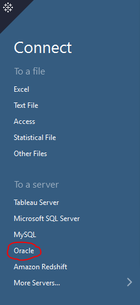
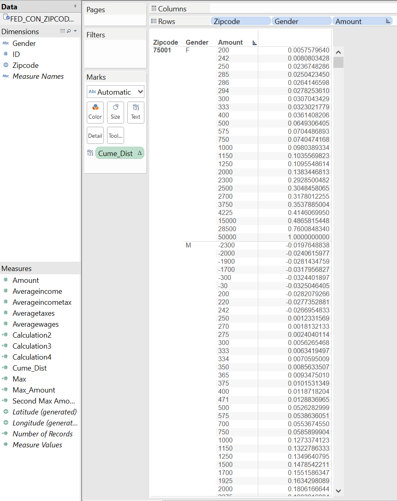

<!-- rmarkdown v1 -->

# Project 6

### Created by Asif Chowdhury, Justin Owens, Jash Choraria

This is the sixth project for CS 329E Data Visualization. 
The data we will analyze comes from the Enigma.io website. 
The topic is a federal election campaign contributors and their contributions.
The goals for this project are to create crosstabs using both R/SQL and Tableau methods.

The explanation of each crosstab produced is found **ONLY** in Step 6.

In order to reproduce this project, please follow the following instructions.

## Step 1

#### Load the correct packages into R

Use the following code to load the correct packages into RStudio.
It might be necessary to install them manually if they have never been installed on your machince prior to this experience.

```{r message = FALSE}
source("../00 Doc/Packages.R", echo = TRUE)
```

## Step 2

#### Clean up the CSV file

Sometimes, the data in a CSV file is incompatible with Oracle. In this situation, we would want to clean up the data. 
Make sure the CSV file is in the appropriate place, as defined by the following code, and modify the working directory in line 1 for your machine. Then run the code in order to get rid of special characters and set data types that are compatible with Oracle. 
You should now have a new CSV File with the reformatted data. 

Due to the complexity in calling directories, we will display the code here, but not run it. This HTML is not dependent on the modified CSV, but if you would like to reproduce our modified CSV, follow the code found in the ReformattingData.R file in the 00 Doc folder or it's representation here.

```{r, eval = FALSE}
setwd(**PLACE WORKING DIRECTORY PATH FOR 00 DOC FOLDER HERE**)

getfile_path <- "Fed_Con_Zipcode.csv"
measures <- c("ID", "ZIPCODE", "Amount", "AverageIncome", "AverageWages", "AverageTaxes", "AverageIncomeTax")

df <- read.csv(file_path, stringsAsFactors = FALSE)

names(df) <- gsub("\\.+", "_", names(df))

# Get rid of special characters in each column.
for(n in names(df)) {
  df[n] <- data.frame(lapply(df[n], gsub, pattern="[^ -~]",replacement= ""))
}

dimensions <- setdiff(names(df), measures)
for(d in dimensions) {
  # Get rid of " and ' in dimensions.
  df[d] <- data.frame(lapply(df[d], gsub, pattern="[\"']",replacement= ""))
  # Change & to and in dimensions.
  df[d] <- data.frame(lapply(df[d], gsub, pattern="&",replacement= " and "))
  # Change : to ; in dimensions.
  df[d] <- data.frame(lapply(df[d], gsub, pattern=":",replacement= ";"))
}

library(lubridate)

# The following is an example of dealing with special cases like making state abbreviations be all upper case.
# df["State"] <- data.frame(lapply(df["State"], toupper))

# Get rid of all characters in measures except for numbers, the - sign, and period.
for(m in measures) {
  df[m] <- data.frame(lapply(df[m], gsub, pattern="[^--.,0-9]",replacement= ""))
}

write.csv(df, paste(gsub(".csv", "", file_path), ".reformatted.csv", sep=""), row.names=FALSE)

tableName <- gsub(" +", "_", gsub("[^A-z, 0-9, ]", "", gsub(".csv", "", file_path)))
sql <- paste("CREATE TABLE", tableName, "(\n-- Change table_name to the table name you want.\n")
for(d in dimensions) {
  sql <- paste(sql, paste(d, "varchar2(4000),\n"))
}
for(m in measures) {
  if(m != tail(measures, n=1)) sql <- paste(sql, paste(m, "number(38,4),\n"))
  else sql <- paste(sql, paste(m, "number(38,4)\n"))
}
sql <- paste(sql, ");")
cat(sql)
```

## Step 3

#### Import and retrieve the data from the Oracle cloud server.

After cleaning up the data, it should be fairly simple to import the table into the Oracle cloud. After doing so, use the following code to create a data frame in R using the newly imported SQL table. This will be useful mostly for when we start using Tableau to create crosstabs.

The FED_CON_ZIPCODE data frame has the following 8 columns: ID, ZIPCODE, GENDER, Amount, AverageIncome, AverageWages, AverageTaxes, AverageIncomeTax

```{r}
source("../00 Doc/FED_CON_ZIPCODE.R", echo = TRUE)
```

## Step 4
#### Use SQL and R to create crosstabs.

Now that the data is uploaded into the cloud properly, we can use R to retrieve crosstabs using SQL commands. 
We have created four crosstabs using rank, max_value, nth_value and cume_dist functions. 
These crosstabs will be explained after recreating them in Tableau in Step 6.

The first crosstab using rank can be created using the following code:

```{r}
source("../01 SQL Crosstabs/RankByAmount.R", echo = TRUE)
```

The second crosstab using max_value can be created using the following code:

```{r}
source("../01 SQL Crosstabs/MAX_AMOUNT.R", echo = TRUE)
```

The third crosstab using nth_value can be created using the following code:

```{r}
source("../01 SQL Crosstabs/N_VALUE_AMOUNT.R", echo = TRUE)
```

The fourth and final crosstab using cume_dist can be created using the following code:

```{r}
source("../01 SQL Crosstabs/AMOUNT_CUME.R", echo = TRUE)
```

## Step 5

#### Import Data for Tableau Crosstabs

Fortunately, we can also recreate the same crosstabs using Tableau.
First, we need to either import the reformatted CSV file directly into Oracle (easiest), or pull the information from the cloud.

In order to import the CSV file, follow these steps:

1) Open Tableau.

2) Click "Connect Data" on the top left corner and then Connect to "Text File" underneath the Connect heading on the left side of the screen.


3) On the screen that appears, locate the reformatted CSV file from Step 2. For this project, the file should be in the 00 Doc folder.

4) On the following screen, click the tab at the bottom left of the screen that says "Sheet 1". This will take you to the main workbook.


Alternatively, you can retrieve the table from the cloud:

1) Open Tableau.

2) Click "Connect Data" on the top left corner and then Connect to "Oracle" underneath the Connect heading on the left side of the screen.



3) In the screen that appears, enter the required information. For our project, the information is:

Server: 129.152.144.84

Service: ORCL.usuniversi01134.oraclecloud.internal

Port: 1521

Username: C##cs329e_ac52722

Password: orcl_ac52722

4) On the following screen, click the tab at the bottom left of the screen that says "Sheet 1". This will take you to the main workbook.


## Step 6

#### Re-create the Crosstabs from Step 4

The crosstabs can be recreated by dragging the correct Dimensions and Measures to the proper places as decribed in the following pictures of the completed crosstabs. The row fields should be the same for every crosstab, so the calculated values are the defining unique features for each crosstab.

For each crosstab, be sure to click on the new sheet button so that you can save each of your crosstabs.

The description of the crosstab is below its respective picture along with an explanation of how to create the calculated field for that table.

**Rank Crosstab:**


This crosstab shows the Ranking for each contribution grouped by Zipcode and Gender.

Make sure Zipcode, Gender and Amount are all changed to Discrete Continuous variables. You can change this by clicking the respective links after right clicking the "blue things" in the worksheet.

You will have to create a table calculation for rank by dragging the "Amount" measure to the TEXT mark. Right click on the mark in the worksheet and click "Rank" under "Quick Table Calculation." Also change the "Compute Using..." to "Amount" by right clicking on the mark and selecting the appropriate options.

The column furthest right shows the individual ranking (highest to lowest) for each contribution amount within each gender category for each zipcode.

**Max_Value Crosstab:**


This crosstab shows the Max Amount of Contribution in each gender category for each Zipcode.

Once again, make sure all of the "blue things" in the rows are Discrete and Continuous.

The only difference between this crosstab and the Rank crosstab is that we replace the Rank calculation with the Max Amount. 
You can create this field by right clicking on Amount in the measures and choosing the option to create a Calculated Field. Change the name of the calculation to be Max_Amount. 

Enter this formula into the "Formula" field: RUNNING_MAX(AVG([Amount]))

Click OK, and the new calculated field will be under the list of measures on the left side of the screen. Drag this measure to the Text Mark. Right click on this newly created mark and change it to compute using "Amount".

The column furthest right shows the Max contribution within each gender category for each zip code. This value is not unique for every row as it was in the ranking cross tab. This could be useful for quickly seeing trends in maximum contribution amounts for each gender category accross zipcodes.

**Nth_Value Crosstab:**


In this crosstab, we are able to get the Nth Ranked Value of contributions within each gender category for each zipcode. This is essentially an extension of the Rank crosstab. Instead of displaying the individual ranks, however, the calculated field will display the value of the Nth Ranked contribution within each grouping. For example, our crosstab finds the 3rd highest value and displays it.

We need to create the calculated field for the Nth Ranking. But before that, we also need to create a parameter. 

Right click on Amount in the Measures on the left side of the screen under the measures and choose the option to create a Parameter. You can change the name of the parameter to "Nth" as in our example. Change the data type of the parameter to Integer. Now give the parameter a customed range. For example, our Nth Parameter shows those values that has rank between 1 to 30.

Now, to create a Table Calculation, Right click on Amount in the Measures on the left side of the screen under the measures. Then choose the option to create a Calculated Field. You can change the name of the measure to "Nth Max Amount" or "Second Max Amount" as in our example.

Enter this formula into the "Formula" field: LOOKUP(AVG([Amount]), FIRST() + [Nth] - 1)

Click OK, and the new calculated field will be under the list of measures on the left side of the screen. Drag this measure to the Text Mark. Right click on this newly created mark and change it to compute using "Amount".

Now right click on the bottom left of the Tableau screen where it says "Nth" under Parameters and then click "Add to Sheet". This will create a slider that will let the user find whichever value they would like.

The column furthest right shows the value of the Nth Ranked amount. This could be useful when you want to compare each amount to the Nth Ranked contribution amount within each grouping.

**Cume_dist Crosstab:**



In this crosstab, we are able to get the cumulative distributions of contributions for each gender category within each zipcode.

Make sure all of the "blue things" in the worksheet are Discrete and Continuous.

We will replace the previous nth_value cacluation with a Cume_Dist calculation.
To make this calculation, right click on the Amount measure in and choosing the option to create a Calculated Field. Change the name of the calculation to be Cume_Dist. 

Enter this formula into the "Formula" field: RUNNING_SUM((SUM([Amount])/TOTAL(SUM([Amount]))))

Click OK, and the new calculated field will be under the list of measures on the left side of the screen. Drag this measure to the Text Mark. Right click on this newly created mark and change it to compute using "Amount".

The column furthest right gives the probability of the contribution being less than or equal to the amount under the Amount column. Remember that these distributions only take the values into account for each gender category within each zipcode.
